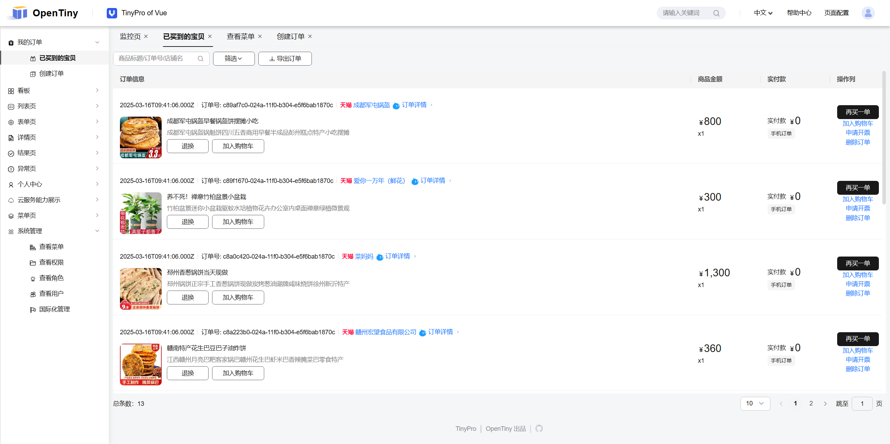
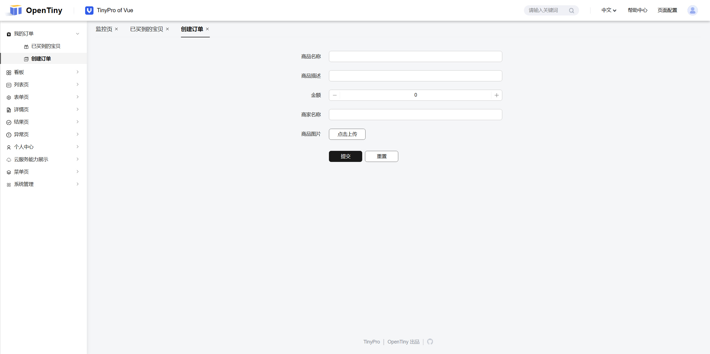

# order-system

[文章](https://juejin.cn/post/7489638329052430355) | [视频1](https://www.bilibili.com/video/BV1PuZBYeEGb/) | [视频2](https://www.bilibili.com/video/BV1aAZYYAEYb/) | [PPT](https://kagol.github.io/ppt-tiny-pro)

```bash
# 启动前端
pnpm dev

# 启动后端
pnpm dev:backend
```

订单管理：



创建订单：


